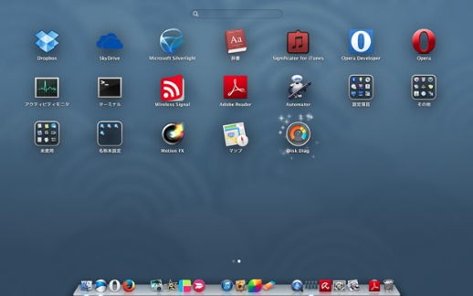

# Untitled

系統平台

1. **系統平台的概念與架構**

小明喜歡玩線上遊戲，他發現這一款的線上遊戲可以容納萬人遊玩，在亞洲、歐洲與非州等地都有伺服器。這款線上遊戲就是一個系統平台，這個系統平台因為硬體、軟體與網路單元的一起工作，才能夠完成運行，本章節從硬體、軟體與網路來帶領大家認識軟體的執行環境-系統平台，最後看看系統平台發展的最新趨勢。

* 1. **系統平台的概念**

系統平台指的是軟體的執行環境，在不同的時代裡，由於軟硬體技術的發展與成熟度不同，對於系統平台的認知也會有不同。我們先來看看在**純粹只有硬體的年代**，系統平台是怎麼運作的。早期的電腦內含固定用途的程式，以1946年情人節 2 月 14 日當天所發表的「ENIAC」為例如圖3-1，如果想要改變電腦的功能就必須修改程式，而在純粹硬體的年代，修改程式就是變更線路與結構，甚至必須重新設計機器，因此早期的電腦是無法輕易的轉變或擴充原有的功能。在這個階段也沒有系統平台這個詞，就是機器在運作。

圖3-1：在ENIAC時代，更改程式就必須更改線路圖

接下來的改善，是內儲程式於電腦硬體的概念。1945 年 6 月是現代電腦科學的里程碑，著名的美籍猶太裔數學家馮·紐曼（John von Neumann）如圖3-2與多位學者聯名發表了一篇長達 101 頁的報告，其中包括兩大建構電腦的原則，其中之一是要被執行的程式得先放在記憶體中要執行時再去記憶體中抓出來1951 年，美國軍方根據這份報告、並透過馮·紐曼的協助，斥資五十萬美元打造了計算機「EDVAC」。內儲程式其原理是指令就像資料儲存於記憶體中，是軟體的雛形。內儲程式電腦改進了原先電腦修改功能就必須修改外部機械或電子開關的不便，將執行的工作化成一連串的指令並且儲存到記憶體中，運算時只要到記憶體中取讀取指令即可，這樣一來電腦的架構有彈性、更改變方便，而這些存放於記憶體中的指令，稱為軟體或程式。

這樣的模式改程式需要先用機器在卡片上打洞，在卡片上寫指令，一個功能就會產生許多張卡片，需要人工將這些卡片送進讀卡機在轉進記憶體，電腦方能執行程式。而隨著電腦的速度的加快，電腦常要暫停來等待人工裝卸讀卡加或者是等待列印，在等待時又不能做其他事情，要成資源的浪費。

圖3-2：馮紐曼先生與其所設計的電腦

後來，1956年IBM為其701電腦發展出GM-NAA I/O，作為電腦的輸出入管理，這一類的軟體被稱為作業系統\(Operating System，OS\)。作業系統提供軟體運行的適當環境，它是一些程式的集合，擁有操作電腦的特殊權限，可以管理電腦的硬體資源。作業系統是開機之後被載入的第一個程式，開機之後其他的程式也是由它所載入的。作業系統環繞著管理電腦資源的目的不停的發展，我們日常的電腦都被作業系統所管理，常見的有微軟的Windows 10、Ubuntu、MAC OS與Android如圖3-3。

圖3-3：現代常見的作業系統

