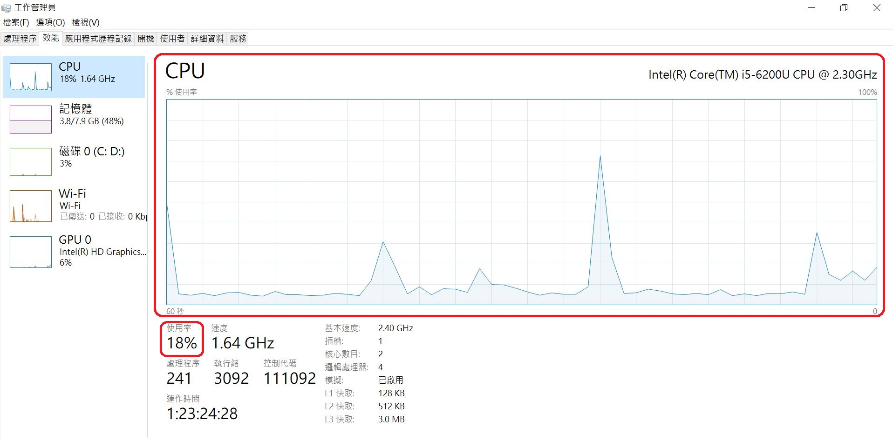
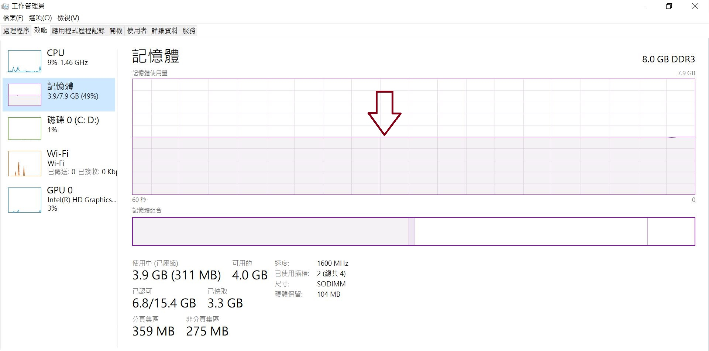

# CH3 系統平台

## 3-1**系統平台的概念與架構**

小明喜歡玩線上遊戲，他發現這一款的線上遊戲可以容納萬人遊玩，在亞洲、歐洲與非州等地都有伺服器。這款線上遊戲就是一個系統平台，這個系統平台因為硬體、軟體與網路單元的一起工作，才能夠完成運行。本章節從硬體、軟體與網路來認識軟體的執行環境-系統平台，最後看看系統平台發展的最新趨勢。

### **3-1-1系統平台的概念**

系統平台指的是軟體的執行環境，在不同的時代裡，由於軟硬體技術的發展與成熟度不同，對於系統平台的認知也會有不同。我們先來看看在**純粹只有硬體的年代**，系統平台是怎麼運作的。早期的電腦內含固定用途的程式，以1946年情人節 2 月 14 日當天所發表的「ENIAC」為例，如圖3-1。如果想要改變電腦的功能就必須修改程式，而在電腦只有硬體的年代，修改程式就是變更線路與結構，甚至必須重新設計機器，因此，早期的電腦是無法輕易的轉變或擴充原有的功能。在這個階段，也沒有系統平台這個詞，就是機器在運作。

接下來的改善，是**內儲程式於電腦硬體**的概念。1945 年 6 月是現代電腦科學的里程碑，著名的美籍猶太裔數學家馮·紐曼（John von Neumann）如圖3-2。他與多位學者聯名發表了一篇長達 101 頁的報告，其中包括兩大建構電腦的原則，其中之一，是要被執行的程式得先放在記憶體中，要執行時再去記憶體中取出資料。在1951 年，美國軍方根據這份報告、並透過馮·紐曼的協助，斥資五十萬美元打造了計算機「EDVAC」。

test

內儲程式其原理是指令就像資料儲存於記憶體中，是軟體的雛形，內儲程式電腦改進了原先電腦修改功能，就必須修改外部機械或電子開關的不便，將執行的工作化成一連串的指令並且儲存到記憶體中，運算時只要到記憶體中取讀取指令即可，這樣一來電腦的架構有彈性、更改變方便，而這些存放於記憶體中的指令，稱為軟體或程式。

這樣的模式，改程式需要先用機器在卡片上打洞，在卡片上寫指令，一個功能就會產生許多張卡片，需要人工將這些卡片送進讀卡機在轉進記憶體，電腦才能執行程式。而隨著電腦的速度的加快，電腦時常需要暫停，來等待人工裝卸讀卡加或者是等待列印，在等待時又不能執行其他工作，造成資源的浪費。

後來，1956年IBM為其型號701的電腦發展出GM-NAA I/O，作為電腦的輸出入管理，這一類的軟體被稱為**作業系統\(Operating System，OS\)**。作業系統提供軟體運行的適當環境，它是一些程式的集合，擁有操作電腦的特殊權限，可以管理電腦的硬體資源。作業系統是開機之後被載入的第一個程式，開機之後其他的程式也是由它所載入的。作業系統環繞著管理電腦資源的目的不停的發展，我們日常的電腦都被作業系統所管理，常見的有微軟的Windows 10、Ubuntu、MAC OS與Android，如圖3-3。

而作業系統的發展又經過哪些轉變呢？

#### 批次系統時期\(Batch System\)

作業系統開始的目的是載入多個程式，使得電腦可以完成一個程式的執行之後，自動載入另一個程式。目的是取代使用人工更換卡片的工作，初步提升了電腦運作的效率。

#### **加入裝置驅動程式\(Device driver\)**

隨著電腦的普及，各種周邊設備開始多樣化，當時周邊設備廠商必須寫各種程式來適應與不同周邊設備的連結。後來，作業系統加入裝置驅動程式，硬體需要與各種周邊設備工作，裝置驅動程式的加入使得使用者可以使用標準化機制和不同的周邊設備互相溝通，簡化了周邊設備連結工作。

#### **多元程式系統架構（Multi-programming）**

當電腦速度變得更快的時候，電腦執行的能力遠超過周邊設備處理資料的能力，多元程式系統是指當電腦中有兩個以上的程式待執行時，它會在CPU執行程式時，因為等待 I/O 而閒置的時間，馬上轉移至另一個程式，替其他的程式服務，以藉此提高 CPU 的使用效率。

#### **分時系統架構\(Time-sharing System\)與多工處理能力\(Multitasking\)**

批次系統與多元程式系統會發生記憶體衝突與資源管理的問題，由分時處理衍生為多工系統。它將 CPU 的工作時間，分割成很多時間片段（Time Slice），每一個提出工作要求的程式都可以使用其中一段，使用完後就換下一個程式使用，便可以同時處理很多件工作。後來發展成將多台終端機接上同一台電腦，讓許多人可以同時使用，進而演變成多人多工的作業系統。當時最著名的作業系統為美國AT&T公司所發展的Unix系統。

#### **各類系統平台與系統跨平台的運作**

各種電腦蓬勃發展的時候，發展出各類的作業系統與應用軟體來解決工作上與生活上的問題，由於各類的作業系統在電腦硬體上扮演著重要的角色，於是人們常以作業系統來區分系統平台，像是Unix平台、Ｗindows平台\(如圖3-4\)、Ubuntu平台\(如圖3-5\)與MacOS平台。而在各類的平台中所設計的應用軟體，通常也是無法安裝到另一個平台去用的，但是許多的軟體開發者各別為系統平台開發應用軟體，有些應用軟體能夠執行專屬的程式，產生的檔案可以在不同的平台被開啟，稱為可以跨平台使用。而程式語言、軟體或硬體裝置可以在多種作業系統或不同的硬體上執行則稱為跨平台。

蘋果公司早期採取封閉式銷售策略，早期自家生產的電腦僅能採用自家生產的OS。後來，改採Intel處理器使得蘋果電腦也能安裝Windows。

當網路被發明時，電腦進入網際網路的年代，使得電腦得以進行資訊的傳播，例如收發Email、瀏覽全球資訊網與觀看Youtube等。隨著網路的蓬勃發展，行動裝置平台與雲端運算平台加入了平台服務。

#### **行動裝置平台**

搭配的作業系統主要是Apple的iOS與Google的Android兩大類，各自都有程式設計應用商店提供應用軟體；後來，有一些穿戴裝置出現如運動手錶、智慧眼鏡與電視盒等，在物聯網\(Internet of Things\)萬物皆可聯網的世界裡，將會有更多樣化的裝置具備簡易的電腦功能，執行環境的平台也會更多元化。

#### **雲端運算平台**

隨著網際網路的發展，系統平台將硬體與作業系統給抽象化，其中一個代表性的例子是Chrome OS，透過Google瀏覽器Chrome當作主要的介面，所有的應用軟體都是透過Google Chrome於雲端執行的，在某種程度上解決跨平台的問題，瀏覽器也被視為一種新型態的系統平台，這樣的工作模式依賴的是網路資源，客戶端電腦對於CPU及記憶體的需求非常低。

#### 延伸閱讀

[ENIAC](https://www.youtube.com/watch?v=bGk9W65vXNA)

[馮紐曼](https://kopu.chat/2017/06/08/lynn_pc_1/)

### 3-1-2系統平台的架構

系統平台的運作方式，由使用者、軟體\(作業系統與應用軟體\)、硬體與網路形成一個運作架構。作業系統作為使用者、應用軟體與硬體之間的溝通管道，使得使用者不需要知道電腦硬體的運作，便可以指揮電腦與其周邊工作或者連上網際網路工作，也因此探討系統平台時，除了探討硬體，作業系統會是軟體中主要探討的項目，然後是網路，其關係圖如3-7。

## 3-2系統平台的組成元素介紹

### 3-2-1電腦硬體的基本架構

系統平台的最底層就是硬體，在1945年時，數學家馮紐曼\(Von neumann\)提出可內除程式概念以及五大單元架構，如圖3-8，將電腦分成記憶單元、算術邏輯單元、控制單元、輸入設備與輸出設備等五大單元，現今電腦仍有五大單元。

五大單元主要的工作描述如下：

**輸入單元\(Input Unit\)：**

用來控制及協調各單元間的運作。例如鍵盤、滑鼠、掃描器與手寫板等，如圖3-9。

#### **輸出單元\(Output\)：**

主要任務是將處理過的結果，從記憶體取出，以文字、數字、圖形或符號等方式顯示出來，或儲存到輔助儲存體上。常見的輸出設備有顯示器、印表機和繪圖機等等，如圖3-10。  
輸入與輸出單元被歸類為電腦周邊設備。

#### **控制單元\(Control Unit\)**：

主要任務是從主記憶體擷取指令碼，加以解碼\(Decoding\)，而發出控制信號，指揮各部門執行該指令規定的工作。

#### **算術邏輯單元\(Arithmetic Unit\)：**

負責執行加減乘除的算術運算及比較、判斷的邏輯運算。 1971年Intel成功的將算術邏輯單元與控制單元製作在一個積體電路上面，並且命名為**微處理器\(Microprocessor\)** ，因此這兩個單元又合稱為**中央處理單元\(Central process Unit ，CPU\)** ，如圖3-11。CPU的組成除了算術邏輯單元與控制單元之外，還包含暫存器\(Register\) ，負責CPU內部的資料存取, 以利CPU快速地存取，是速度最快的記憶體。

電腦運算能力突飛猛進，是因為電腦自身CPU的運算能力加快之外，還有以下的三個因素：

**多個核心或多處理器：**在一台電腦內有一個微處理器含多個核心或者一台電腦含多個微處理器。  
以雙手資源與搬磚頭的例子來說明多處理器與多核：例如，你需要搬很多磚，你現在有一百隻手，當你將這一百隻手安裝到50個人身上工作，這模式就是多CPU；當你將這一百隻手全安裝到一個人身上，這模式就是多核。  
個人電腦與手持設備具有一個處理器，這個微處理器會包含多個核心；而目前的超級電腦則是一台電腦內會有數以千計以上的微處理器，達成驚人的運算能力，例如：「台灣杉二號」（TAIWANIA 2）的AI超級電腦。

**透過網路，聯合多台電腦的微處理器進行運算：美國**科技趨勢預測專家Kevin Kelley，在其網路未來5000天演講的描述，說明這個現象：世界上有一部機器\(The One\)，Web是它的作業系統，所有的螢幕都通向這部機器，這部機器是一部巨大有機體，他就是我們，我們就是這部機器，如圖3-12。

**圖形處理器的加持：**GPU（graphics processing unit）則是繪圖處理器，主要負責電腦中顯示與繪圖相關的工作項目。CPU 含有數顆核心，用來為循序的序列處理進行最佳化。GPU 則含有數千個更小型且更高效率的核心，藉以加速科學、分析、工程、消費和企業應用。

#### **記憶單元\(Memory Unit\)：**

記憶單元還包含「主記憶體（Main Memory）」與輔助記憶體，詳細分類如圖3-13。

主記憶體，容量較小，存取速度快，多用來儲存正在處理的程式和資料，目前手機與電腦常使用動態隨機存取記憶體\(Dynamic RAM, DRAM\)最為主記憶體的元件，如圖3-14。

主記憶體主要分成隨機存取記憶體\(Random Access Memory，RAM\)與唯讀記憶體\(Read only Memory，ROM\)。RAM又分為DRAM\(Dynamic RAM\)，中文可以翻譯為動態隨機存取記憶體，而什麼叫做動態呢? 意思就是不穩定的意思，在 DRAM 裡是利用電容來儲存資料的，因此 DRAM 必須藉由定期的重新充電來保持它內部的資料狀態。至於SRAM \(Static\) ，則可以翻譯為靜態隨機存取記憶體，相對於動態，靜態指的當然就是穩定的意思，在SRAM中是使用邏輯閘，儲存資料的狀態，用這種方法的好處就是不需要像動態那樣定期充電就可以保持資料的狀態，而且內部資料的傳輸速度也相對較快，但是成本較高。

唯讀記憶體ROM 是在硬體製造的過程中，資料被一併寫進晶片裡，所以當一顆 ROM 完成的時候，它內部的資料就已經定型了，如此一來，它就可以在不用電力供給的狀況下來儲存資料了，但是這種做法也會帶來一些限制，正如其名， ROM 內部的資料就只能夠被寫入一次，而且只能夠被讀取，不能改寫，所以 ROM 內部放的通常都是不會被使用者所變動到的資料，例如基本輸入輸出系統\(Basic Input/Output System, BIOS\)，這些資料通常會在開機之後的第一時間被載入 Main Memory\(RAM\) ，接著傳給 CPU 執行，等作業系統以及其他程式就位之後，就算完成了開機的動作。 CPU或CPU與主記憶體間，還有快取記憶體\(Cache memory\)，用來存放即將可能被執行的程式與資料，可減少CPU對記憶體的存取次數，提升電腦整體執行速度。

另一種是「輔助記憶體（Auxiliary Memory），用來存放所有程式和資料，例如硬碟\(Hard Disk Drive, HDD\)與或者固態硬碟\(Solid-State Drive, SSD\)等。

硬體五大單元之間，要透過匯流排\(Bus\)才能互相溝通，是電腦各個單元之間用來傳遞電子訊號的線路通道，如圖3-15。依照其工作性質，可以分為三類：

**資料匯流排（Data Bus）**：在CPU與RAM之間來回傳送需要處理或是需要儲存的資料，是雙向傳輸排線。

**位址匯流排（Address Bus）**：由中央處理單元出發到記憶體單元的匯流排，是單向傳輸排線。

**控制匯流排（Control Bus）**：將微處理器控制單元（Control Unit）的訊號，傳送到周邊裝置，是單向傳輸排線。

匯流排的工作性質可以分成以上三種類型，但是如PCI、PCI 與SATA等這些常見的業界標準，同時都會包含資料匯流排、控制匯流排與位置匯流排的線路。

說了這麼多理論，當我們購買電腦時該如何選擇才好呢？當然困擾我們的總是價格與效能之間的平衡。到底哪一些硬體單元才是效能的考慮重點呢？處理器、記憶體與硬碟是重要的考慮。

#### 資源分配

#### **學習加油站：**

台灣杉二號：[https://www.youtube.com/watch?v=xcg-jDHleDs](https://www.youtube.com/watch?v=xcg-jDHleDs)

凱文・凱利 Kevin Kelly 演講  
網路世界的未來五千天：[https://www.youtube.com/watch?v=yDYCf4ONh5M](https://www.youtube.com/watch?v=yDYCf4ONh5M)

### 3-2-2作業系統的組成

處理器、記憶體與硬碟常是選購電腦硬體的考慮重點 ，因為他們將影響著電腦效能。為了充分發揮電腦效能，電腦資源（處理器、記憶體與硬碟）就應該被妥善管理與分配。當你感覺電腦變慢了，有想過先透過電腦的作業系統來了解變慢的原因嗎？可以從資源分配與工作排程兩個任務，來理解作業系統的運作。

#### 資源分配

為了有效利用電腦資源，作業系統最主要的任務就是協調與控制各個程式的運作，包含程序管理、CPU與GPU負載、記憶體分配、檔案管理、周邊設備管理、網路流量監控，以下以Window10作業系統為例說明作業系統各項管理工作。

程序管理  
程序指的是目前正在執行的程式，在電腦中的執行順序。而這個執行的順序是由作業系統管理，使得CPU能夠發揮最大的效能。在Windows10中，使用鍵盤的Ctrl+Alt+Del可以呼叫出工作管理員畫面，如圖3-16，畫面上顯示電腦中各個應用系統的執行程序並且分析耗費的資源。

CPU負載  
在Windows10作業系統的工作管理員，點選效能中的CPU，可以了解此台電腦CPU的附載情形。例如此台電腦目前CPU附載率18%，如圖3-17，處於輕負載的狀態。

記憶體分配  
在Windows10作業系統的工作管理員，點選效能中的記憶體，可以了解主記憶體在電腦中被分配使用的狀況，如圖3-18。

網路流量監控  
在Windows10作業系統的工作管理員，點選效能中的wifi，可以觀察當下網路的傳送與接收速率，如圖3-19。

檔案管理：  
使用者可直接透過作業系統對檔案做新增、讀取、刪除、變更檔案名稱及更改目 錄等的動作，而不需考慮檔案在磁碟中的實際儲存位置。作業系統通常被安裝在C磁碟，圖3-20中藍色的狀態表示硬碟使用的情形，若以紅色呈現時必須清理磁碟空間以免影響效能。

#### 工作排程

良好的工作排成可以提高工作效率，想像一下，當你到便利商店取一個貨品時，發現前面排隊的一位小姐瘋狂購物取貨，趕時間的你心裡想著如果能讓辦理單一業務的人往前，那該有多好。這時櫃檯服務人員就也看到這個問題，開始思考如何在同一個時間服務更多人，就需要制定一套規則出來，目標是運用現有的珍貴的資源達到最高效率。

系統平台也需要好的工作排程，作業系統就如同櫃台人員一般，必須思考CPU運作最佳效能，在擁有最高產量的前提下，作業系統在分配資源時會考量以下的準則：  
工作完成量越大越好，完成工作所需的時間和等待時間越小越好。  
以下介紹一些CPU排程的方法先到先執行、最短工作優先與優先權排程，稱為CPU排程演算法。

我們假設一個狀態，有三個程序A、B與C，以及每一個程序所需花費的CPU執行時間如下表3-1：  
表3-1

| 工作 | 執行時間\(秒\) |
| :--- | :--- |
| P1 | 30 |
| P2 | 9 |
| P3 | 6 |

**先到先執行**  
先到先執行如同抽號碼牌等候一樣，先來先做\(first come first served, FCFS\)，這樣的方法首先確認抵達順序然後開始分配資源。

若抵達的順序為P1, P2, P3時，工作順序如圖3-21：  
\(1\)P1不需要等待，所以P1等待時間為0秒。  
\(2\)P2需要等P1執行完畢，所以P2等待時間為**30**秒。  
\(3\)P3需要等P1, P2執行完畢，所以P3等待時間為30+9=39秒。  
平均等待時間為\(0+30+39\)/3=23  
同理，平均完成時間為\(30+39+45\)/3=38

若抵達的順序為P2, P3, P1時，工作順序如圖3-22：  
\(1\)P2不需要等待，所以P2等待時間為0秒。  
\(2\)P3需要等P2執行完畢，所以P3等待時間為9秒。  
\(3\)P2需要等P2, P3執行完畢，所以P1等待時間為9+15=24秒。  
平均等待時間為\(0+9+24\)/3=11  
同理，平均完成時間為\(9+15+45\)/3=23

FCFS是一種簡單、公平，但會因為到達順序不同而有不同的效率。如果先服務的工作執行時間相對較長，會讓其他工作有較長等待，造成工作效率差。日常生活中常會發生的護送效應，例如在體積大速度慢的大車後面，會擠滿過不去的機車與小車。

**最短工作優先**  
最短工作先做\(shortest job first, SJF\)是每次等待服務的工作中，找出執行時間最短者，優先取得資源分配。以表3-11的程序為例，程序由短而長是P3, P2與P1，工作順序如圖3-23：  
平均等待時間\(0+6+15\)/3=7  
平均完成時間\(6+15+45\)/3=22

SJF排程效益佳，平均等待與完程時間最小，但是預知工作的執行時間是有困難的。

**優先權排程**  
給每一個處理程序優先等級，並依照優先等級將處理程序由高優先等級排至低優先等級，然後依序分派處理程序佔有 CPU。以表3-11的程序為例，指定優先權為是P2, P1與P3，工作順序如圖3-24：  
平均等待時間\(0+9+39\)/3=16  
平均完成時間\(9+39+45\)/3=31

優先權排程的優點是重點工作可以安排交高優先權。但此排程會造成優先權低者永遠在等待的狀態。

#### 記憶體的置換

想像一下當你到一個遊樂場時，必須換搭遊園公車才能抵達目的地，在等待的同時肯定非常期盼 快點搭上遊園公車。記憶體就如同遊園公車，位置是有限的！電腦一開機之後就必須啟動許多程序，再加上我們會開始開啟一些應用程式如照相、通訊軟體與瀏覽器等軟體如圖3-25，這些程序在執行過程都會被載到記憶體，而記憶體的空間有限，漸漸的被塞滿，於是就會有誰該被移出與誰該被載入的問題。

**網路連線**  
以下是主記憶體分配使用的一些原則：  
1.程式與主記憶體都會被預割：主記憶體會預先切割成固定大小的區塊，程式會被預先切割成固定大小的分頁。  
2.當主記憶體被塞滿，而且有新的分頁必須｢移入時，原先占用主記憶體資源的程式，該如何｢移出\(swap out\)  
3.有某些分頁必須載入主記憶體，程序才能運行，該如何｢移入\(swap in\)?

移出\(swap out\)：將程式的分頁遊主記憶體移回硬碟  
移入\(swap in\)：將放在硬碟中的分頁移入到主記憶體

以下介紹三種記憶體的置換\(移入與移出\)方法：

**先進先出置換法**  
FIFO:先進先出\(First In First Out，FIFO\)置換法，最早進入記憶體的分頁最早被移出。

**最少使用置換法**  
最少使用\(Least Frequently Used, LFU\)置換法，最少被使用的分頁會優先移出

**最久未使用置換法**  
最久未使用\(Least Recently Used, LRU\)置換法，最久未被使用的分頁優先移出。

以上的工作遊作業系統執行。作業系統（Operating System，OS）是管理電腦硬體與軟體資源的程式，同時也是電腦系統的核心與基石，作業系統的型態非常的多樣，如下表3-2，不同機器安裝的OS可從簡單到複雜，可從手機的嵌入式系統到超級電腦的大型操作系統。許多作業系統製造者對OS的呈現也不大一致，例如有些OS整合了圖形化使用者介面，而有些OS僅使用文字介面，而將圖形介面視為一種非必要的應用程式。

| 類型 | 說明 | 作業系統 |
| :--- | :--- | :--- |
| 單人單工 | 同一時間只允許單一個使用者，執行單一個程式。 | MS-DOS |
| 單人多工 | 同一時間只允許單一個使用者，執行多個程式。 | Ｗindows 10與Mac OS |
| 多人多工 | 同一時間只允許多個使用者，執行多個程式。 | Ｕnix、Linux與Ubuntu |

## 3-3網際網路

一台電腦再怎麼強大，CPU與記憶體都是有限的，如果將一台、十台、百台與千台的電腦連接起來，彼此分享資源與程式，電腦的力量就會非常強大！今天的網際網路已經做到將全世界數億台電腦連接起來，形成了一個網際網路的世界，改變人類的生活型態，舉凡購物、看電影、聽音樂與送郵件訊息，指尖一滑就可以盡情遨遊網上服務，這個虛擬世界是如何開始的？又帶來哪些驚奇，電腦間是如何完成這個任務的，以下一一介紹。

### 3-3-1網際網路的誕生

#### **網際網路的誕生是來自於軍事的需求**

第二次世界大戰以後，蘇聯與美國的關係是非常敵對的，美國害怕蘇聯的原子彈技術越來越發達，擔心當原子彈落下的那一天，如果軍事資料是集中存放在電腦中，資料將毀於一旦。最後，害怕當原子彈落下的那一天，美國將軍事資料分散儲存於不同的地方，然後再繼續研究這些分散的資料如何連結的問題。  
****1969 年在美國西部架設了一個實驗網路，連接加州與猶他州四所大學中的電腦設備，這個網路的特色是萬一有部分的網路出問題，其他電腦仍能靠其他線路維持連線，此網路稱做 ARPANET，為網際網路\( Internet\) 的前身。

#### **網路上的電腦需要有位址**

當越來越多的電腦連結在一起時，問題就出現了？人們該如何在這些電腦上尋找資料？  
於是1973年時，就提出每一台電腦都必須有IP位址\(詳見3-3-2網際網路運作原理的通訊協定\)。就如同每一間屋子都必須有地址一樣，只要是與網際網路連線的電腦，都必須有自己的地址。這個地址稱為IP，由一連串的數字所組成的，例如｢140.123.95.191」，也因為是由一長串數字所組成，很難被記錄或使用。因此，文字形態的網域\(Domain Name\)相應產生，每一個IP位址可以定義文字形態的位址以方便使用。

#### **搜尋系統與全球資訊網**

有了IP位址與網域，這麼多的電腦怎麼會知道我需要的資料放在哪裡？  
在1990年，加拿大的一名大學生設計了Archie程式。這個程式能夠收集來自全球伺服器的資料並且建置資料庫，只要使用者下搜尋指令，就可以幫使用者找到符合條件的內容。

後來有了大家熟悉的WWW，WWW是全球資訊網（World Wide Web的縮寫），是瑞士日內瓦研究機構 Tim Berners Lee在1989所發明，目的是為了傳送文字、圖片與聲音。 在實際上，他以相關文件相互連結的超連結為基礎，簡單的說，就是透過某一個文件連接到另一個網頁的連結。  
在網路上只要使用滑鼠點選，就能連接到另外一個網頁：  
網頁與網頁之間能夠彼此連接的功能是為｢超連結」；  
含有超連結的文件、圖片與影音等資料稱為｢超文件」；  
連結這些圖片、聲音與影像的系統就是｢全球資訊網」。

**網頁瀏覽器**

**學習加油站**  
Tim Berners Lee談網路的未來：[https://www.ted.com/talks/tim\_berners\_lee\_on\_the\_next\_web?language=zh-tw](https://www.ted.com/talks/tim_berners_lee_on_the_next_web?language=zh-tw)

### 3-3-2網際網路運作原理

電腦是怎麼上網的？上網的設備可以是電腦、智慧型手機或者其他設備，這些設備必須連接上**網路連接設備，**例如路由器\(Router\)、交換器\(Switch\)、無線網路基地台\(無線網路AP\)或是具有4G上網功能手機所模擬的熱點\(無線網路AP\)；透過已經被設計好的規定，稱**為通訊協定**\(Protocol\)，透過不同的傳輸媒介進行資料的傳輸。而上網的電腦則因距離的不同可以區分為不同網路類型。

#### **網路的連線方式**

常見的上網方式被歸納為表3-3：

| 類型 | 設備 | 說明 |
| :--- | :--- | :--- |
| 行動上網 | 內建4G上網功能的平板電腦或智慧型手機 | 透過電信公司基地台上網 |
| 無線上網 | Wi-Fi分享器 | 透過無線網路基地台\(AP\)上網 |
| 有線寬頻上網 | 路由器 | 透過有線電纜或光纖等方式上網 |

誰會提供上網服務呢？是網際網路服務提供者ISP\(Internet Service Provider\)。表3-4是常見的ISP服務

<table>
  <thead>
    <tr>
      <th style="text-align:left">ISP&#x696D;&#x8005;</th>
      <th style="text-align:left">&#x55AE;&#x4F4D;</th>
      <th style="text-align:left">&#x670D;&#x52D9;&#x65B9;&#x5F0F;</th>
      <th style="text-align:left">&#x670D;&#x52D9;&#x5C0D;&#x8C61;</th>
    </tr>
  </thead>
  <tbody>
    <tr>
      <td style="text-align:left">TANet&#x81FA;&#x7063;&#x5B78;&#x8853;&#x7DB2;&#x8DEF;</td>
      <td style="text-align:left">&#x6559;&#x80B2;&#x90E8;</td>
      <td style="text-align:left">
        
&#x7121;&#x7DDA;WiFi

        
&#x56FA;&#x63A5;&#x5C08;&#x7DDA;

      </td>
      <td style="text-align:left">&#x5B78;&#x6821;&#x3001;&#x7814;&#x7A76;&#x55AE;&#x4F4D;</td>
    </tr>
    <tr>
      <td style="text-align:left">&#x96FB;&#x4FE1;&#x516C;&#x53F8;</td>
      <td style="text-align:left">&#x96FB;&#x4FE1;&#x696D;&#x8005;</td>
      <td style="text-align:left">
        
&#x7121;&#x7DDA;WiFi

        
&#x884C;&#x52D5;&#x7DB2;&#x8DEF;

      </td>
      <td style="text-align:left">&#x4E00;&#x822C;&#x6C11;&#x773E;&#x3001;&#x7D44;&#x7E54;&#x6A5F;&#x69CB;</td>
    </tr>
    <tr>
      <td style="text-align:left">&#x7D44;&#x7E54;&#x6A5F;&#x69CB;</td>
      <td style="text-align:left">&#x7E23;&#x5E02;&#x653F;&#x5E9C;&#x3001;&#x90F5;&#x5C40;&#x8207;&#x706B;&#x8ECA;&#x7AD9;&#x7B49;</td>
      <td
      style="text-align:left">&#x7121;&#x7DDA;WiFi</td>
        <td style="text-align:left">&#x4E00;&#x822C;&#x6C11;&#x773E;</td>
    </tr>
  </tbody>
</table>#### **網路的類型**

區域網路（Local Area Network:LAN\)**：**  
是內部專用網路，範圍可以是一個辦公室、一層樓或者一棟樓  
◆例子：學校的電腦教室，如圖3-29

都會網路（Metropolitan Area Network:MAN\)：   
涵蓋範圍包括一個城市或都會區的規模。  
例子：在台北的某一個總公司與其在台北他處分公司電腦連線，此狀況屬MAN 

廣域網路（Wide Area Network:WAN\)  
所涵蓋的範圍可以說是州與州、國與國、地區與地區的通訊網路，它將不同地區的區域網路連接在一起，便構成了廣域網路，，這種連接大幅增強了網路的利用價值。  
例子：台灣高品質學術研究網路\(TaiWan Advanced Research and Education Network, TWAREN\)是典型的廣毓網路，是國家電腦中心建立，連接全國學術與研究單位的一個大型網路，如圖3-30。

#### 網路傳輸媒介

#### 網路設備

#### 通訊協定

## 3-4未來發展

### 3-4-1雲端運算

### 3-4-2物聯網

### 3-4-2人工智慧

